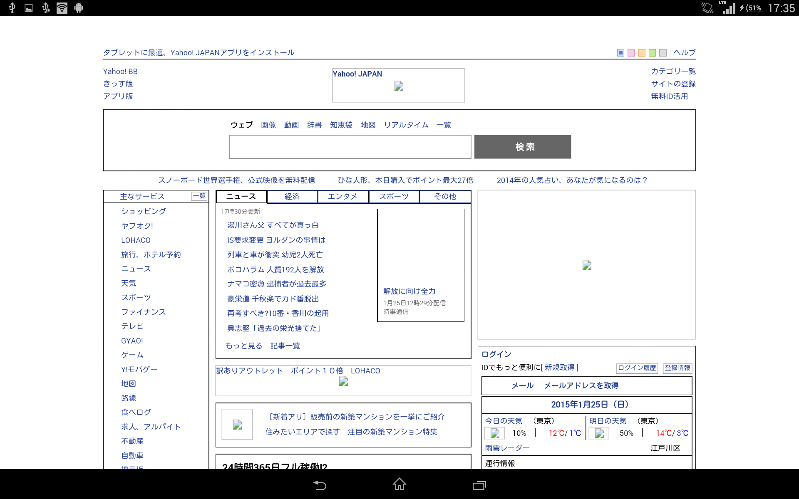

== Cordova
=== 脆弱性の傾向
==== Android

2015年5月時点、Android 版 Cordovaには、7件の脆弱性が報告されている。

.Cordovaの脆弱性
[width="70%", cols="1,3", options="asciidoc"]
|=======
|CVE           |タイトル
|http://cve.mitre.org/cgi-bin/cvename.cgi?name=CVE-2012-6637[CVE-2012-6637] |ホワイトリスト保護メカニズムを回避される脆弱性
|http://cve.mitre.org/cgi-bin/cvename.cgi?name=CVE-2014-1881[CVE-2014-1881] |イベントベースのブリッジのデバイスリソース制限を回避される脆弱性
|http://cve.mitre.org/cgi-bin/cvename.cgi?name=CVE-2014-1882[CVE-2014-1882] |イベントベースのブリッジのデバイスリソース制限を回避される脆弱性
|http://cve.mitre.org/cgi-bin/cvename.cgi?name=CVE-2014-3500[CVE-2014-3500] |スタートページを変更される脆弱性
|http://cve.mitre.org/cgi-bin/cvename.cgi?name=CVE-2014-3501[CVE-2014-3501] |HTTP のホワイトリストを回避される脆弱性
|http://cve.mitre.org/cgi-bin/cvename.cgi?name=CVE-2014-3502[CVE-2014-3502] |任意のアプリケーションを起動される脆弱性
|http://cve.mitre.org/cgi-bin/cvename.cgi?name=CVE-2015-1835[CVE-2015-1835] |外部から preferences を悪用される脆弱性
|=======

個々の脆弱性の詳細については Appendix を参照して欲しい。

2014年10月、Google は、Google Play で Cordova を使用したハイブリッドアプリを公開している開発者に対し、Cordova のバージョンを 3.5.1 以上に更新することを促す注意喚起のメッセージを送付している。footnote:[http://community.phonegap.com/nitobi/topics/security-alert-apache-cordova-vulnerabilities-in-your-google-play-app] アップデートを放置した場合、対象となるアプリは "dangerous products" と判断され、Google Play から削除される可能性があるとされているが、本調査では、実際に削除されたアプリの有無を確認していない。

CVE-2014-3501 は、Android の仕様に起因する脆弱性であり、2015年2月現在、修正されていない。脆弱性の発見者は、アプリ開発者が CSP を使って対策することを論文の中で提案している。 footnote:[http://www.slideshare.net/ibmsecurity/remote-exploitation-of-the-cordova-framework] footnote:[https://www.owasp.org/index.php/AppSec_Israel_2014_Presentations#The_Bank_Job_-_Mobile_Edition._Remote_Exploitation_of_the_Cordova_Framework_for_Android]

==== iOS

iOS 版 Cordova に関する脆弱性はこれまでに公開されていない。厳密に言えば、2014年にテキサス大学の研究者らによって、ネイティブ側の実装が iframe からのブリッジに対する要求をメインのウィンドウからの要求であると勘違いし、window.top に対して応答を返却する問題 (Frame Confusion) が指摘されている。footnote:["Frame confusion complicates the exploitation of interface-based local-to-Web bridges on some platforms. The ‘stringByEvaluatingJavaScriptFromString’ and ‘WebBrowser.InvokeScript’ functions, used by the framework’s local half on iOS and Windows Phone, respectively, to inject JavaScript into browsers, execute it in the main frame, not the iframe that invoked the bridge (http://www.cs.utexas.edu/~shmat/shmat_ndss14nofrak.pdf)] この指摘について MITRE は、Cordova の設計上の欠陥(脆弱性)なのか iOS の既知の振る舞いなのかを判断できないとしている。footnote:["We currently don't know whether to classify this as an implementation
error or something closer to "known behavior." This behavior does not
seem to be referenced in the apachecordovaphonegap-bypass.txt summary" (http://openwall.com/lists/oss-security/2014/02/07/9)]

=== ホワイトリスト
==== メカニズム(Cordova 3.x)
ホワイトリストは、WebView 上でアクセス可能なリソースをあらかじめ指定したドメインのみに制限するためのセキュリティ機能である。アプリ開発者は、Cordova アプリの config.xml に &lt;access origin="[origin]" /&gt; のように記述することでホワイトリストを定義することができる。この仕様は http://www.w3.org/TR/widgets-access/[W3C Widget Access] に基づいている。

たとえば、google.com のすべてのサブドメイン (たとえば mail.google.com や docs.googlee.com) へのアクセスを許可したい場合、次のように指定する。

 <access origin="http://*.google.com" />

ホワイトリストは Cordova が備える唯一のセキュリティ保護機能であり、アプリに脆弱性が存在する場合、攻撃のリスクを軽減する効果を持つ。しかし、ホワイトリストの指定方法の柔軟さ、実装上の制限、運用の難しさなどから、アプリの開発者が適切にホワイトリストには、多くの課題がある。

ホワイトリストの初期値はすべてのドメインへのアクセスを許可する。

==== 実装上の課題
ホワイトリストの定義方法や振る舞いは、Cordova が動作するプラットフォーム毎に異なる。Cordova は、WebView 上でのリソース要求をネイティブ側でフックするためにプラットフォームが提供する API を用いてアクセス制限を行っている。そのため、API のサポートが十分でない OS では、ホワイトリストによる制限を十分に行うことができない。

以降、Android と iOS のホワイトリストにおける、実装上の問題を述べる。

===== Android
* バージョン 3.1.0 未満の Android 版 Cordova は、ホワイトリストに基づくアクセス先 URL 検証を前方一致で行っていた。そのため、ホワイトリストに指定されたドメインをホスト名の先頭に含む他のドメインの URL は、アクセスの許可されたドメインであるとみなされる
** たとえば、foo.com がホワイトリストに登録されている場合、foo.com.evil.com はホワイトリストによる保護をパスしてしまう

* Android 2.x 系の端末では、ホワイトリストに基づくアクセス先 URL の検証を WebViewClient#shouldOverrideUrlLoading で実装しているため、iframe や XMLHttpRequest による信頼されないリソースに対するアクセスをホワイトリストで制限できない

* Android 4.3 以下の端末では、&lt;video&gt;や&lt;audio&gt; によるストリームメディアへのアクセスをホワイトリストで制限できない

* WebSocketによるアクセスを制限できない

* Cordova 3.6.0 未満では、sms: や mailto:、intent: などの URL へアクセスすると、無条件でその URL を処理できる他のアプリを開く
** この性質を悪用することで、アプリが持つ機密情報を他のアプリを通じて盗み出せることが指摘され (CVE-2014-3502)、Cordova 3.6.0 で、External Application Whitelist という仕組みが導入された
** External Application Whitelist は &lt;access origin="sms:{asterisk}" launch-external="yes" /&gt; のような書式で config.xml に指定する
** launch-external="yes" が指定された origin を含むリンクは、暗黙的インテントにより、外部のアプリで開かれる
*** http で始まる URL を記載することにより、http:// や https:// のリンクをデフォルトのブラウザ上で開くこともできる

* ホワイトリストで許可された URL からは、許可されていない URL へもリダイレクトできる
** ホワイトリストで許可されたオリジンにオープンリダイレクタの脆弱性がある場合、ホワイトリストの制限回避に悪用される恐れがある。外部サイトへのリンクのアクセス数を記録するためにリダイレクタを設置しているサイトや、短縮URLをホワイトリストで許可している場合も、この影響を受ける

* ホワイトリストに指定するオリジンとして、スキームを指定せず origin="example.com" というようにホスト名のみを記述した場合、http:// と https:// の両方によるアクセスが暗黙的に許可される

* ホワイトリストに何も指定しない場合でも、file:、content:、data: に対するアクセスは無条件で許可される。攻撃者は、これらのスキームを通じて悪意のある HTML や JavaScript を Cordova アプリに開かせ、任意の JavaScript を実行させることができる。ただし、content: と data: スキームの HTML からブリッジに対するアクセスは阻止される

===== iOS

* ホワイトリストに何も指定しない場合でも、file:、content:、data:に対するアクセスは無条件で許可される footnote:[Cordova の初期化時に config.xml を解析するオブジェクトの実装。オブジェクトの初期化時に file://{asterisk}, content://{asterisk}, data://{asterisk} をホワイトリストに追加している(https://github.com/apache/cordova-ios/blob/3.7.x/CordovaLib/Classes/CDVConfigParser.m#L43)]

* アクセス先の URL が sms: や mailto: などのカスタム URL スキームである場合、その URL を処理できるアプリが開かれる。
** Android 版 Cordova では、同様の実装が脆弱性として指摘され (CVE-2014-3502)、対策として、External Application Whitelist という機能が実装されているが、iOS 版 Cordova には、2015年2月時点、External Application Whitelist と同様の仕組みが存在しない

* Android 版 Cordova と同様に、ホワイトリストの設定時にオリジンのプロトコルスキームを省略した場合、http と https でのアクセスを許可する。footnote:[スキームが指定されなかった場合、スキームを http, https としてホワイトリストに2つのエントリーを追加している(https://github.com/apache/cordova-ios/blob/3.7.x/CordovaLib/Classes/CDVViewController.m#L794)] したがって、プロトコルスキームを省略した場合に意図せず http 通信を行い、中間者攻撃の影響を受ける可能性がある

* origin="https://{asterisk}.{asterisk}.google.com" というように、サブドメインに「{asterisk}.」を2つ以上連続で指定した場合、正規表現の不備によりホスト名が「{asterisk}」のみとなる footnote:[ホスト名を抽出する正規表現は {asterisk}. の後に {asterisk}. が再度来るケースを想定していないため、{asterisk}.{asterisk}.google.comの場合は {asterisk} がホスト名となってしまう(https://github.com/apache/cordova-ios/blob/3.7.x/CordovaLib/Classes/CDVWhitelist.m#L172)] このため、開発者が意図せず全てのホスト名をホワイトリストで許可してしまう可能性がある。

==== 運用上の課題

Cordova を使用する 7167 個の Android アプリを対象に対して行われたテキサス大学の調査によると、2124個 (約30%) のアプリのホワイトリストで、全てのドメインが許可されていた。footnote:[https://www.cs.utexas.edu/~suman/publications/suman_ndss14.pdf]

研究者らは、ホワイトリストの運用上の課題として次の2点を指摘している。

1. 一般的なウェブサイトの多くが複数のドメインからリソースを取得しているため、アプリがアクセスする可能性のあるドメインを開発者が事前に網羅的に把握していない限り、ホワイトリストを定義できない

2. 信頼できないリソースを避けるために広告配信サイトをブロックすると、アプリ内広告が表示されず、広告収入を得られなくなる

テキサス大学の指摘1 を検証するため、ホワイトリストに http://www.yahoo.co.jp のみを指定して Yahoo Japan! のトップページを開いたところ、次のように画面表示が大きく崩れる結果が得られた。

[[yahoo_japan]]
.Yahoo Japan! のみをホワイトリストに登録してアクセスした場合

=== 対策方法
==== 最新の Cordova を使用する

https://github.com/apache/cordova-android/blob/master/RELEASENOTES.md[Cordovaのリリースノート]を定期的に確認し、自身のアプリに影響のある脆弱性の情報がアナウンスされた場合は、Cordovaをアップデートしてアプリを作り直す。

2015年6月時点、外部アプリから攻撃可能な脆弱性 CVE-2015-1835 が対策されている Cordova 3.7.2 または 4.0.2 以上を使用することが望ましい。

Cordova をアップデートした場合、リグレッションが発生する、あるいは既存のアプリの変更や再検証が必要となることも考えられる。たとえば、Android 版 Cordova 3.6.0 では External Application Whitelist が導入されたため、アプリ開発者が config.xml を変更しない限り、mailto: や sms: スキームの URL を開くことができない。このように、Cordova の仕様変更の影響を受け、正常に動作していたプラグインが動かなくなるケースが考えられる。

==== 信頼できるリソースしか開かないように制限する

前項に記載したとおり、信頼できるリソースのみを開かないよう制限する。

==== CSP の利用
https://developer.mozilla.org/en-US/docs/Web/Security/CSP[CSP] (Content Security Policy) は、XSS やデータインジェクションといったWebアプリに対する攻撃を緩和する保護機能である。

W3C により標準化が進められており、2015年9月現在、 http://www.w3.org/TR/CSP/[CSP 1.0] 及び、それに改良を加えた http://www.w3.org/TR/CSP2/[CSP Level 2] が Candidate Recommendation である。CSP 1.0 は XSS に代表される不正なコンテンツを注入する攻撃の軽減に注力しており、CSP Level 2 では、さらに広い範囲の攻撃を緩和することを目指している。X-Frame-Options や X-XSS-Protection といった既にブラウザに搭載されている保護機能は、今後は廃止されて、CSP に統合されることになっている。

Cordova アプリにおいても、CSPを適切に活用することで、悪性コードによるブリッジの悪用や、ホワイトリストの穴を突いた攻撃の緩和を期待できる。しかし、CSP を利用できる OS は、Android 4.4 以上および iOS 7 以上であり、特に Android においては CSP をサポートする端末の普及が十分とは言えないのが現状である。

Android 4.0 以降の端末では、標準の WebView の代わりに Crosswalk を利用することでCSPを使用できる。 footnote:[https://crosswalk-project.org/documentation/manifest/content_security_policy.html] Crosswalk は、Chrome ブラウザと同等の CSP が利用できる上、W3C の http://www.w3.org/TR/appmanifest/[Manifest for web application] に対応しており、Manifest ファイルを用いて WebView の外から CSP を適用できる。

Android 版 Cordova は現時点では CSP に対応していないため、CSP の保護機能の一部を無効化する必要がある。CSP には、文字列から JavaScript のコードを動的生成するようなメソッド (eval等) の実行を制限する機能が存在する。 footnote:[http://www.w3.org/TR/CSP/#directive-script-src] しかし、Android 版 Cordova 3.6.4 では、一部の処理に eval が用いられているため、この制限を適用できない。

iOS 版 Cordova は CSP に対応しており、CSP でインラインスクリプトや eval の使用制限を施しても動作する。ただし、JavaScript からネイティブ側へのブリッジに iframe を使用するため、CSP の frame-src 句に「gap:」を指定し、ブリッジアクセスの際に使われる gap スキームの URL をフレーム内で開くことを許可しなければならない。

利用する Cordova プラグインや、JavaScript のライブラリ、フレームワークの中にはCSP に非対応のものがある。たとえば、Media プラグイン 0.2.16 未満は内部処理でeval() を利用するため、CSP の制限を緩和するかプラグインのアップデートが必要となる。同様に、他のプラグインにおいても、CSP を有効化した状態で動作するかどうかの確認が必要となる。

また、アプリが利用する JavaScript のライブラリやフレームワークが CSP に対応しているかどうかも事前に確認が必要となる。以下に対応状況の例を挙げる。

* jQuery 1.11 未満は CSP に対応していない

 * Knockout は CSP に対応していないため、第三者が fork して作成した CSP 対応ビルド (Knockout Secure Binding) を使う必要がある

* AngularJS は古くから CSP が有効でも動作するモードを備えており、開発者が ngCsp というディレクティブを指定することでこれを有効化できる。ただし、AngularJS の開発者によると、CSP を有効化すると実行速度が30%遅くなる

* Vue.js は AngularJS を fork して作られた軽量のフレームワークであるが、標準では CSP に対応していないため、CSP 対応ブランチにあるものを使用する必要がある

* React 0.5 未満 は CSP に対応していない
